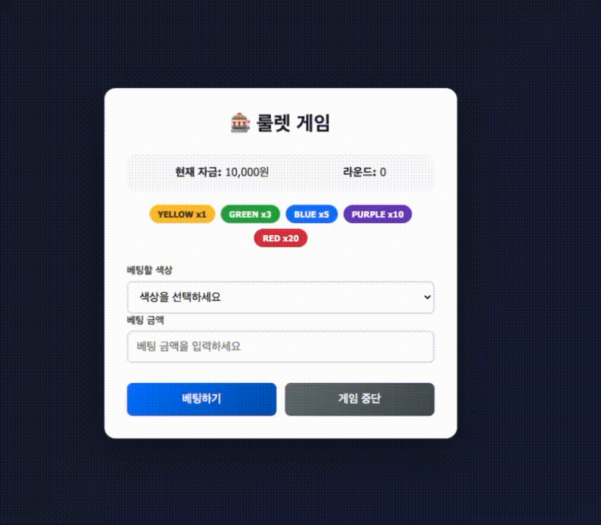

<p align="middle" >
  
</p>
<h1 align="middle">탐욕의 룰렛 게임</h1>

## 🔍 진행방식

- 미션은 **기능 요구사항, 프로그래밍 요구사항, 과제 진행 요구사항** 세 가지로 구성되어 있다.
- 세 개의 요구사항을 만족하기 위해 노력한다. 특히 기능을 구현하기 전에 기능 목록을 만들고, 기능 단위로 커밋 하는 방식으로 진행한다.

---

### 🎰 룰렛 규칙

룰렛은 총 **40칸**으로 구성되어 있으며, 각 칸은 아래 색상 중 하나로 이루어져 있다.

| 색상   | 칸 수 | 확률   | 배당 |
| ------ | ----- | ------ | ---- |
| YELLOW | 21    | 52.5%  | x1   |
| GREEN  | 10    | 25%    | x3   |
| BLUE   | 6     | 15%    | x5   |
| PURPLE | 2     | 5%     | x10  |
| RED    | 1     | 2.5%   | x20  |

- 각 칸은 **동일한 확률**로 선택된다. (40칸 중 1칸 = 2.5%)
- 배당 적용 방식은 아래 규칙을 따른다.
  - 베팅 시 베팅 금액은 자금에서 **차감**된다.
  - **베팅 성공**: `베팅 금액 + (베팅 금액 × 배당)`을 획득한다. (원금 회수 + 배당금)
  - **베팅 실패**: 베팅 금액을 잃고 라운드가 종료된다.

#### 📌 배당 계산 예시

| 베팅 색상  | 베팅 금액 | 결과 | 계산                | 획득 금액 |
| ---------- | --------- | ---- | ------------------- | --------- |
| YELLOW(x1) | 500원     | 성공 | 500 + (500 × 1)     | 1,000원   |
| GREEN(x3)  | 1,000원   | 성공 | 1,000 + (1,000 × 3) | 4,000원   |
| RED(x20)   | 100원     | 성공 | 100 + (100 × 20)    | 2,100원   |
| BLUE(x5)   | 500원     | 실패 | -                   | 0원       |

---

## 🎯 기능 요구사항

확률 기반 룰렛 베팅 게임이다.

- 게임 시작 시 플레이어는 **초기 자금 10,000원**을 가진다.
- 플레이어는 매 라운드마다 **베팅을 진행**하거나 **게임을 중단**할 수 있다.
- 베팅을 진행하면 **색상**과 **베팅 금액**을 입력한다.
- 룰렛을 돌리면 결과는 즉시 나오지 않으며, **2초(2000ms)** 가 지난 후 결과가 출력된다.
- 룰렛 결과가 플레이어가 선택한 색상과 같으면 **베팅 성공**, 다르면 **베팅 실패**이다.
- 자금이 0원이 되면 게임이 종료된다.
- 게임이 종료되면 **최종 자금**과 **플레이한 라운드 수**를 출력한다.
- 사용자가 잘못된 값을 입력한 경우 `alert`으로 에러 메시지를 보여주고, 다시 입력할 수 있게 한다.

---

### 💻 실행 결과 예시



---

## ✅ 프로그래밍 요구사항

### 입력(사용자 액션)

- 색상 선택: `#color-select`에서 아래 중 하나를 선택한다.
  - 🟡 YELLOW, 🟢 GREEN, 🔵 BLUE, 🟣 PURPLE, 🔴 RED
- 베팅 금액 입력: `#bet-amount`에 1원 이상의 정수를 입력한다.
- 베팅 실행: `#bet-button` 클릭
- 게임 중단: `#stop-button` 클릭
- 다시 시작: `#restart-button` 클릭

### 출력(UI 반영)

#### 1) 초기 화면(페이지 진입 시)

- `#current-money`는 `10,000`이 표시된다.
- `#current-round`는 `0`이 표시된다.
- `#result-box`는 보이지 않는다.
- `#restart-button`는 보이지 않는다.
- `#bet-button`, `#stop-button`는 활성화 상태다.

---

#### 2) 베팅 시작 직후(`#bet-button` 클릭 직후)

- `#current-money`는 베팅 금액만큼 즉시 차감되어 표시된다.
- `#bet-button`, `#stop-button`는 비활성화된다.
- `#result-box`가 보이도록 표시된다.
- `#result-content`에 아래 문구가 표시된다.

```markdown
**룰렛을 돌리는 중...**
```

---

#### 3) 베팅 결과(2초 후)

- `#current-round`가 1 증가하여 표시된다.
- `#result-content`에 아래 정보가 표시된다.

```markdown
**룰렛 결과: {색상}**
```

- 결과 색상은 `.result-color` 요소로 표시된다.
- `#bet-button`, `#stop-button`는 다시 활성화된다.

---

#### 4) 베팅 성공 시(결과 화면)

- 성공 메시지가 표시된다.

```markdown
**베팅 성공! +{획득 금액}원**
```

---

#### 5) 베팅 실패 시(결과 화면)

- 실패 메시지가 표시된다.

```markdown
**베팅 실패! -{손실 금액}원**
```

---

#### 6) 게임 종료

- 아래 조건 중 하나를 만족하면 게임이 종료된다.
  - 사용자가 `#stop-button`를 클릭한 경우
  - 자금이 0원 이하가 된 경우 (파산)
    - 룰렛 결과와 함께 `#result-content`에 `게임이 곧 종료됩니다.` 파산 안내 메시지가 표시된다.
    - 2초 뒤에 게임 종료 화면으로 전환된다.
- 종료 시 `#result-box`에 최종 결과가 표시된다.

```markdown
**게임 종료**
**최종 자금:** {금액}원
**플레이한 라운드:** {라운드 수}
```

- `#game-controls`는 숨김 처리된다.
- `#restart-button`가 표시된다.

---

#### 7) 예외 출력(유효하지 않은 입력)

- 유효하지 않은 입력이 들어오면 `alert`로 에러 메시지를 표시한다.
- 에러 발생 시 아래 상태는 변경되지 않아야 한다.
  - `#current-money`
  - `#current-round`
  - 버튼 활성/비활성 상태

---

### 공통 요구사항

- `var`를 사용하지 않는다. `const`, `let`만 사용한다.
- 전역 변수를 사용하지 않는다.
- 외부 라이브러리를 사용하지 않고, 순수 Vanilla JS로만 구현한다.
- [Airbnb 자바스크립트 코드 컨벤션](https://github.com/airbnb/javascript)을 지키면서 프로그래밍 한다.
- indent(인덴트, 들여쓰기) depth를 2가 넘지 않도록 구현한다.
  - 예를 들어 while문 안에 if문이 있으면 들여쓰기는 2이다.
  - 힌트: indent depth를 줄이는 좋은 방법은 함수(또는 메소드)를 분리하는 것이다.
- 함수(또는 메소드)가 한 가지 일만 하도록 최대한 작게 만들어라.
- `import` 문을 이용해 스크립트를 모듈화하고 불러올 수 있게 만든다.
- 함수(또는 메소드)의 길이가 15라인을 넘어가지 않도록 구현한다.

---

### 스타일링 요구사항(선택)

- 스타일링은 자유롭게 구현한다.
- 제공된 HTML 구조와 id/class는 변경하지 않는다.
- 비활성화된 버튼은 시각적으로 구분되어야 한다.
- 베팅 성공/실패 결과는 시각적으로 구분되어야 한다.

---

## 📝 과제 진행 요구사항

- 미션 저장소를 Fork/Clone해 시작한다.
- **기능을 구현하기 전에 `docs/README.md` 파일에 구현할 기능 목록을 정리**해 추가한다.
- **Git의 커밋 단위는 앞 단계에서 README.md 파일에 정리한 기능 목록 단위**로 추가한다.
  - [AngularJS Commit Message Conventions](https://gist.github.com/stephenparish/9941e89d80e2bc58a153)을 참고해 commit log를 남긴다.

---

## ✉️ 미션 제출 방법

- 미션 구현을 완료한 후 GitHub을 통해 제출한다.
- 미션을 제출할 때에는 docs의 markdown 파일에 기능 목록이 적어져 있어야한다.
- 테스트를 통과해야만 제출이 가능하다.

---

## ✔️ 테스트 실행 가이드

- 테스트 실행에 필요한 패키지 설치를 위해 `Node.js` 버전 `20` 이상이 필요하다.
- 다음 명령어를 입력해 패키지를 설치한다.

```bash
npm install
```

- 설치가 완료되었다면, 다음 명령어를 입력해 테스트를 실행한다.

```bash
npm run test
```

- 모든 테스트가 pass한다면 성공!

---

## 🔗 참고 링크

- JavaScript module
  https://ko.javascript.info/modules-intro
- Javscript timer
  https://developer.mozilla.org/ko/docs/Web/API/setTimeout
